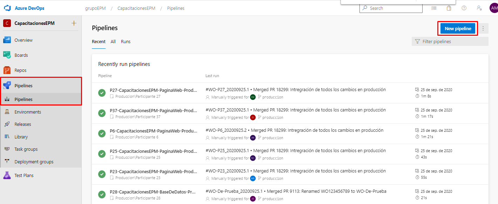
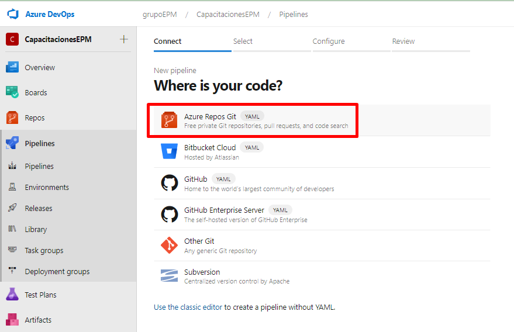
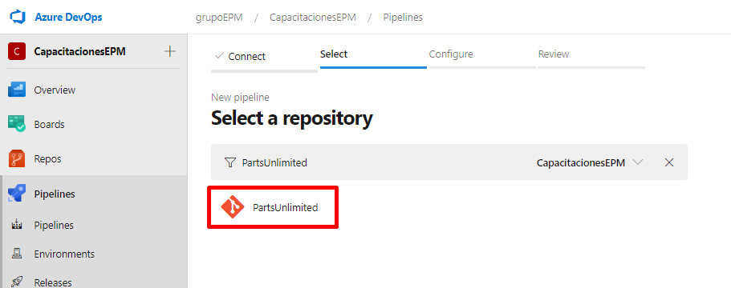
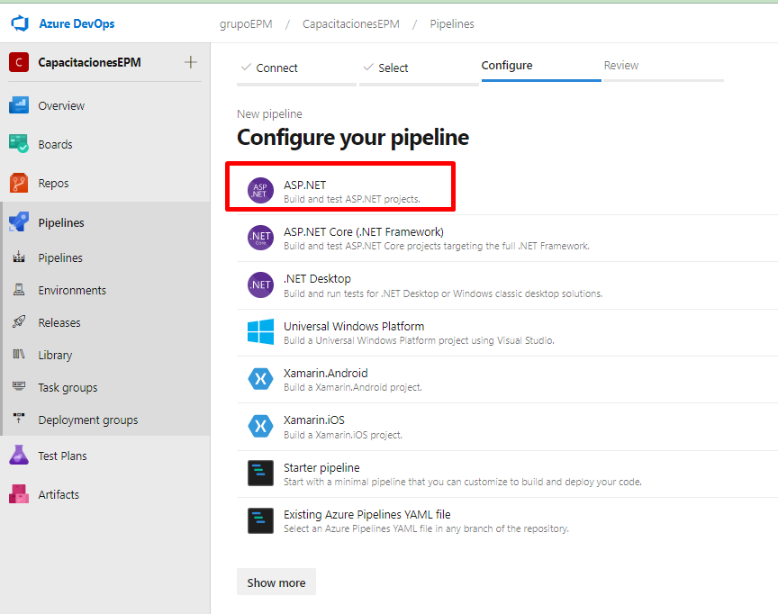

En esta sesión, se llevará a cabo la creación de un pipeline como YAMl a partir de una plantilla ya predefinida para compilar aplicaciones .NET

Ubicados en el proyecto de [CapacitacionesEPM](https://grupoepm.visualstudio.com/CapacitacionesEPM) en la organización de grupoEPM, dirigirse al módulo de Pipelines y navegar hacia la pestaña de Pipelines.

Una vez allí, en la parte superior derecha, se encuentra el botón para crear una nueva definición de pipeline de build.

En esta sección seleccionamos la opción en la parte superior **"Azure Repos Git YAML"**. De esta manera se llevaría a cabo la creación de la definición a partir de pipelines como código

Seleccionar el repositorio de **PartsUnlimited**.

Seleccionar la plantilla ya predefinida para compilar aplicaciones .NET

