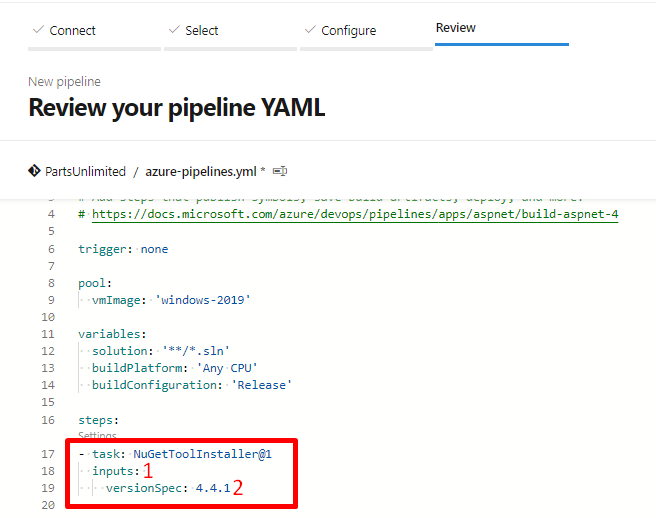
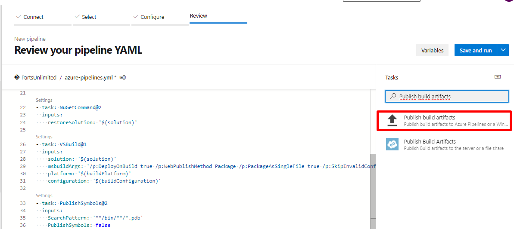

En esta sesión, se modificará el pipeline como YAML, para la compilación y generación de artefactos de forma satisfactoria

Ubicados en la pestaña de review, en el cual se puede observar la definición del pipeline de integración continua, se realizará las siguientes modificaciones: 

1.Cambiar el agente por **windows-2019**

2.Establecer el valor de trigger en none 

3.Remover tarea de VSTest (Esto ya que el proyecto que se está usando para las pruebas es uno que ofrece Microsoft para realizar experimentos, sin embargo, actualmente están fallando unas pruebas unitarias)

4.Adicionar la versión **4.4.1** a la tarea de **NuGetToolInstaller**, el cual se realizaría de la siguiente manera: 

5.Adicionar la tarea **PublishSymbols**, para este paso, nos apoyaremos del asistente que ofrece la plataforma para configurar nuevas tareas.

5.1 Cursor en la última parte del archivo, para que a la hora de configurar la nueva tarea quede ubicada en ese lugar

5.2 Abrir asistente 

5.3 Buscar la tarea **Index sources and publish symbols**

5.4 Adicionar tarea 

6.Adicionar la tarea **PublishBuildArtifacts**, para este paso, nos apoyaremos del asistente que ofrece la plataforma para configurar nuevas tareas.

6.1 Cursor en la última parte del archivo, para que a la hora de configurar la nueva tarea quede ubicada en ese lugar (Como se muestra en el punto 5.1)

6.2 Abrir asistente de configuración de tarea (Como se muestra en el punto 5.2)

6.3 Buscar la tarea **Publish build artifacts**

6.4 Adicionar tarea 

**Nota:** Cuando se trata de pipelines como código, es importante mantener la identación del archivo, ya que YAML es bastante estricto en cuanto al orden de cada uno de los parámetros de configuración, por lo que se podrían estar generando errores, por ejemplo 

7.Finalmente, la definición debería quedar como en el archivo a continuación

[Pipeline YAML .NET](./assets/azure-pipelines.yml)

