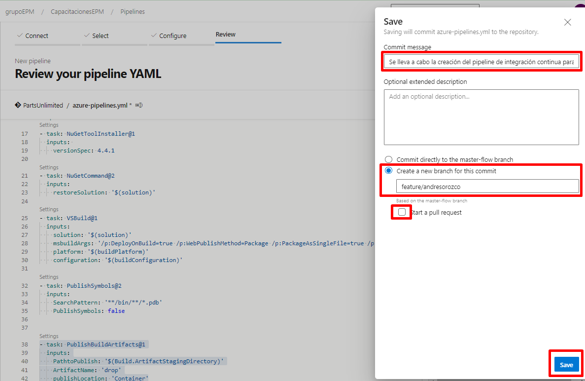

En esta sesión, guardarémos el pipeline en una rama feature y ajustaremos el nombre del pipeline acorde a la definición establecida, esta la pueden observar en el boletín publicado en el proyecto de Escalando DevOps [Boletín N°8 - Estándar de nombramiento para los pipelines](https://dev.azure.com/grupoepm/EscalandoDevOpsEPM/_wiki/wikis/EscalandoDevOpsEPM.wiki/742/Bolet%C3%ADn-N%C2%B08-Est%C3%A1ndar-de-nombramiento-para-los-pipelines)

1.Una vez asegurada la configuración de la definición, se procede a guardar el pipeline en una nueva feature.

1.1 Guardar la definición 

1.2 Realizar el commit sobre una nueva rama llamada **feature/SuNombre** para guardar la definición de pipeline creado.

2.Ya versionado y guardado el pipeline de integración continua, se procede a ajustar el nombramiento de la definición y a su vez moverlo a la carpeta correspondiente.

Teniendo en cuenta la definición, el nombre para esta definición se plasmará de la siguiente manera: **CapacitacionEPM-Aplicacion.(NombrePersona)-General-IC**. En cuanto a la ubicación de la carpeta, se va a almacenar la definición en **\PartsUnlimited\YamlPipeline\General**

