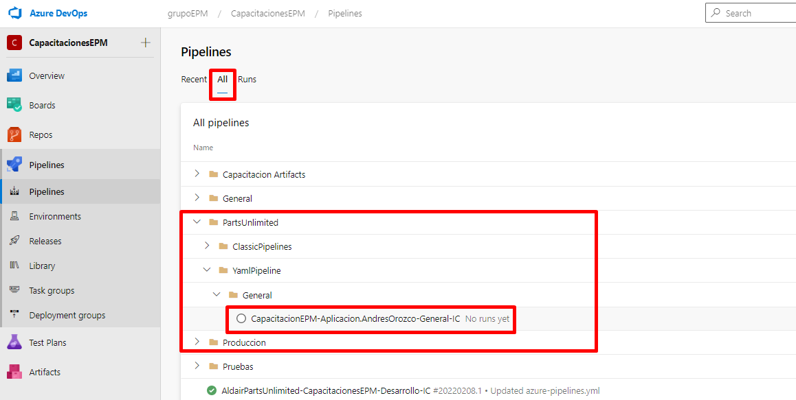
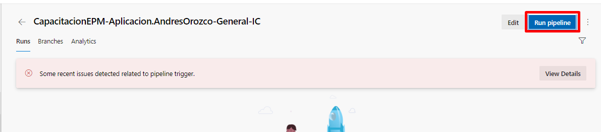
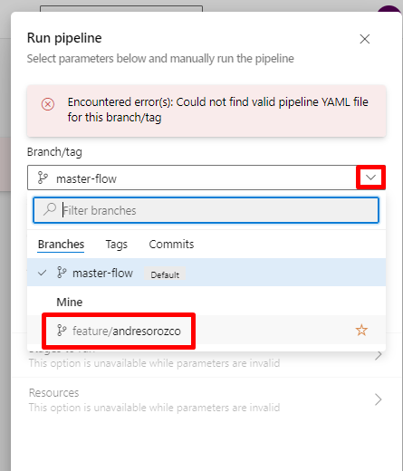
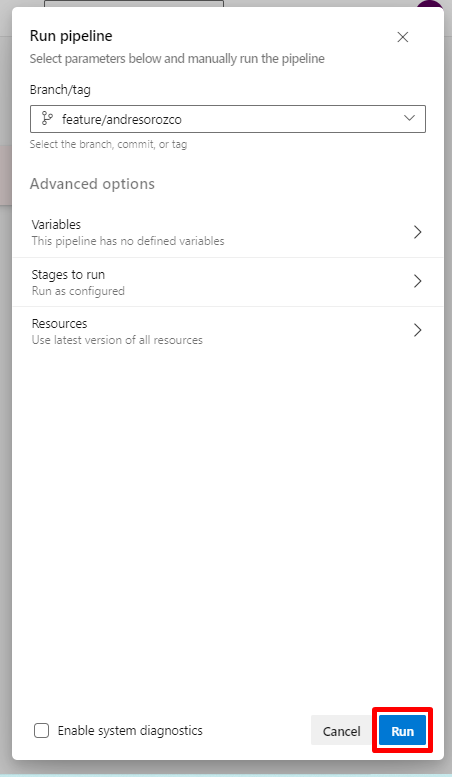
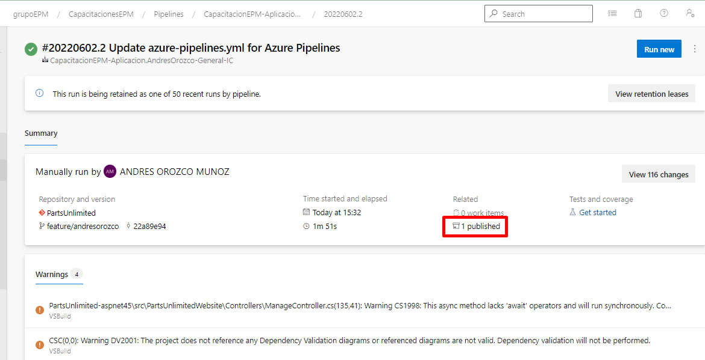
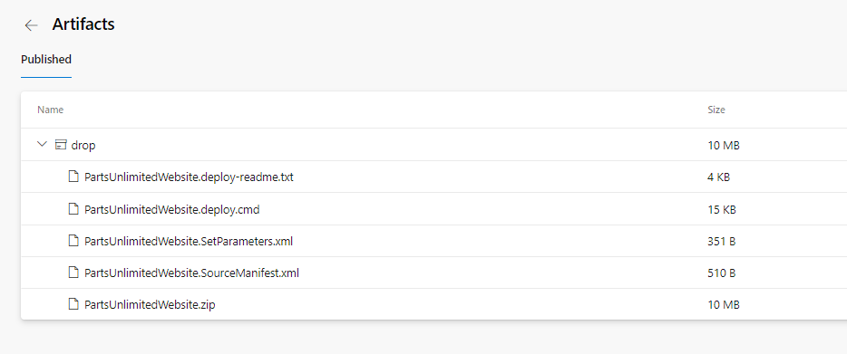

En esta sección, se llevará a cabo la ejecución del pipeline de integración continua para el proyecto de Parts Unlimited

Ubicados en el módulo de pipelines sobre la pestaña de build, procederemos a buscar la definición creada por cada uno.

Ingresamos en el pipeline, y se procede a ejecutar especificando la rama creada por cada uno 
 

Una vez finalice la ejecución, en la sección de artefactos se podrá observar los paquetes generados, los cuales posteriormente serán usados para efectuar el proceso de despliegue

