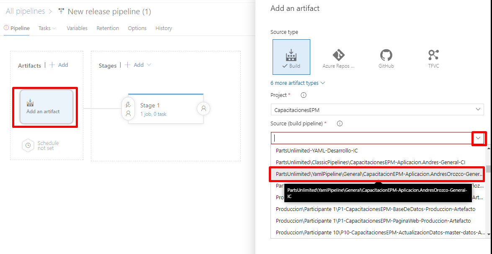

Una vez allí, nos dirigimos a la sección de Artifacts y añadiremos un nuevo artefacto, en este seleccionaremos el pipeline de integración continua creado anteriormente por ustedes en la variable de Source (build pipeline), una vez seleccionado la definición, en el source alias añadiremos la palabra clave que identifica el componente, siendo este una aplicación web, añadiremos al inicio **WebApp**. Una vez finalizado el proceso damos clic en **Add**.

