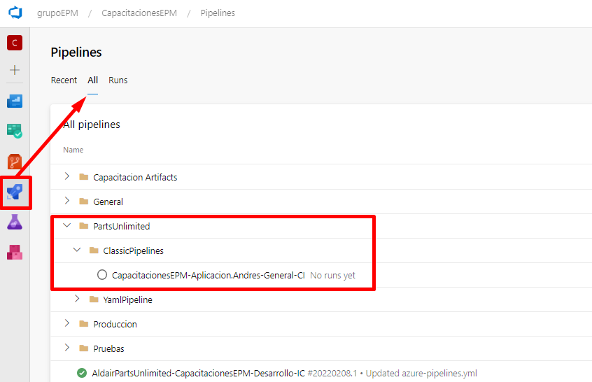
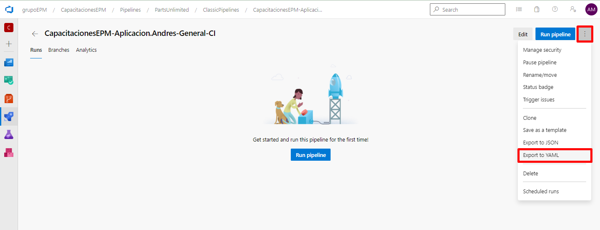
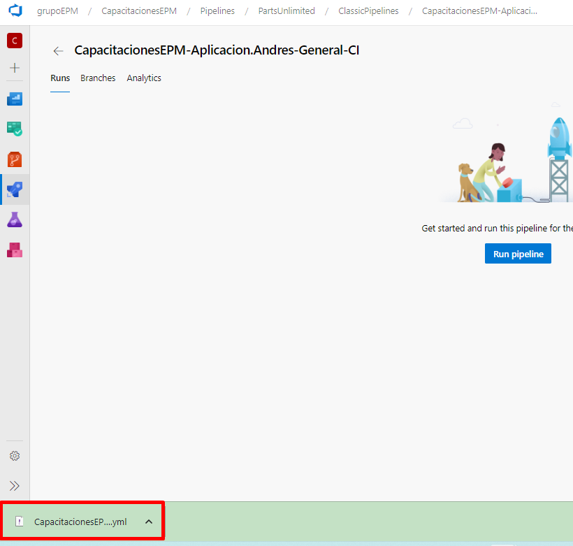

Ya guardada la definición de pipeline de build clásica, se procede a navegar en el lugar donde quedo almacenado la definición, de la siguiente manera 

Una vez sea identificada la definición del pipeline, se da click sobre ella y se procede a exportar el YAML

Finalmente, se descarga el archivo YAML en nuestra máquina

